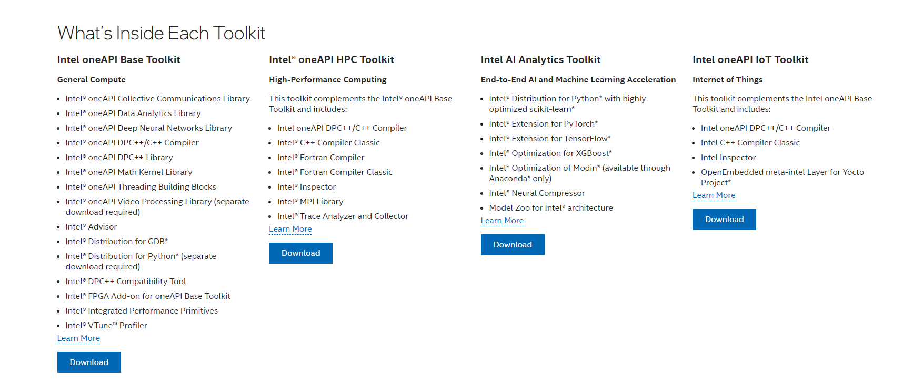

# **Installing Intel new version 2023.1 (Windows 10)**

The steps below demonstrate how to update to the latest Intel Fortran release. 

## **Prerequisites**

* Remove the existing installation of **Intel BaseKit and HPC Toolkit** 
* It is assumed that the **Microsoft Visual Studio is already installed**; 

* Navigate to **help** and click **About Microsoft Visual Studio**. 

* It shows the information:

## **Installation steps**

1) Navigate to the link:

https://www.intel.com/content/www/us/en/developer/tools/oneapi/overview.html#gs.5zteuz

2) Select **Toolkits** under **oneAPI**.

3) We are interested in **two toolkits**. They must be installed in the order:

* Intel oneAPI Base Toolkit

* Intel oneAPI HPC Toolkit

4) If you click **Intel oneAPI base Toolkit** the following page appears. It shows the general discription of the components.

5) Click **Download** under **Intel oneAPI Base Toolkit** and choose **Windows**

6) Select **Online Installer** under **Select distribution**

7) Select **2023.1** under **Select version**

8) Select the last option as shown here

9) The **download folder** looks like

10) **Double click** to install the BaseKit. It will take a while to finish installation.

11) Follow the same procedure (go to step 5 picture for reference) for **Intel oneAPI HPC Toolkit**

12) Go down the page and select **Fortran Compiler**:

13) Click **Get It Now** and see the download folder. It is downloaded there.

14) Now double click to install **Intel Fortran compiler**.

15) Go to **start menu** and find the **Intel oneAPI 2023** weejust installed:

16) **Great Job!** 

---

**Date : 24 September 2023**
