# **Installing Dislin 11.5 ( Windows 10 )**

The steps below demonstrate how to update to the latest Dislin version. It has following main parts:

* Download and install Dislin distribution
* Configuration of the system
* Testing the installation
* Compiling double precision module

## **Download and installation**
1. Navigate to the link:

https://www.dislin.de/index.html

2. Click **Downloads**.

3. Select **Distributions**

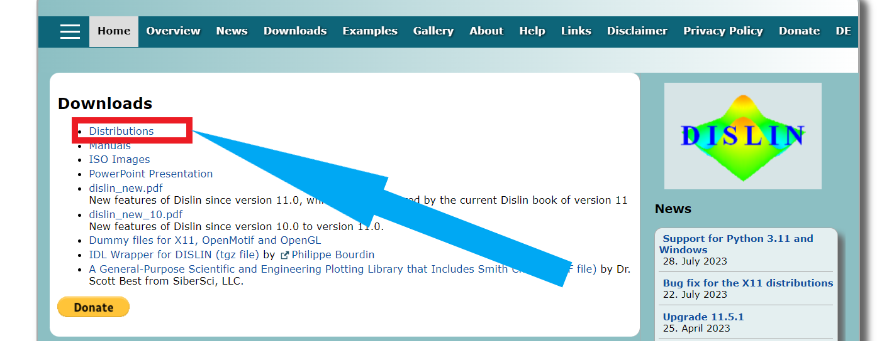

4. Choose **Windows 64 bit**

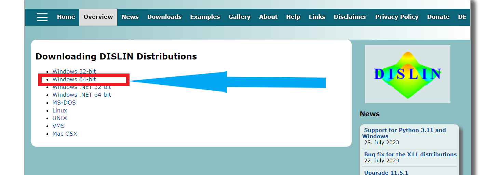

5. Find the **distribution** for windows.

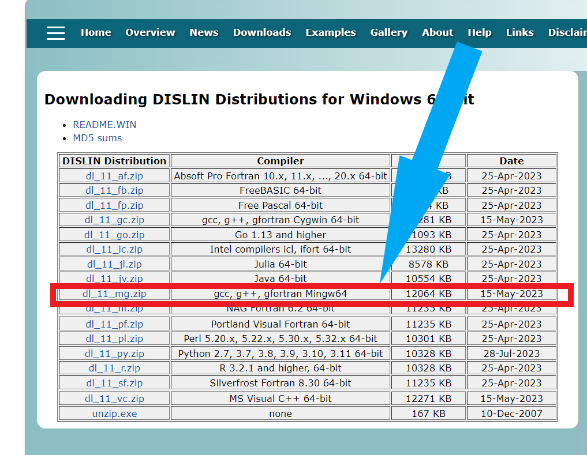

6. The dislin is downloaded in the **Download folder** 

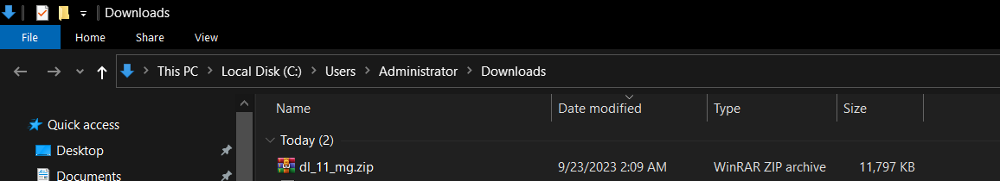

7. **Extract** it there. 

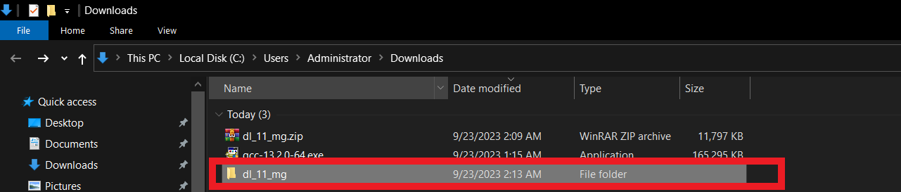

8. Open the **extract folder** and click **setup.exe**. 

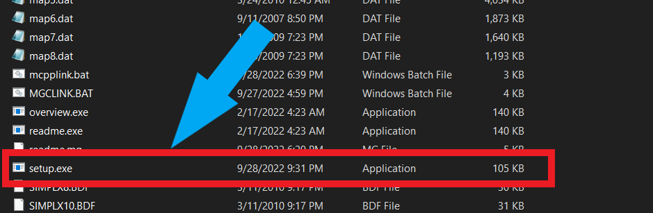

9. The following window will appear. Click **OK**.

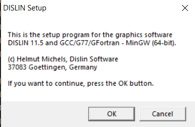

10. The following default setting will appear. Click **OK**. **Note:** This installation directory must be different from the temporary working directory.

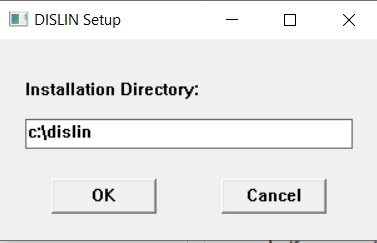

11. The installation takes a while. Once **installation is done**, the dislin directory looks like. 

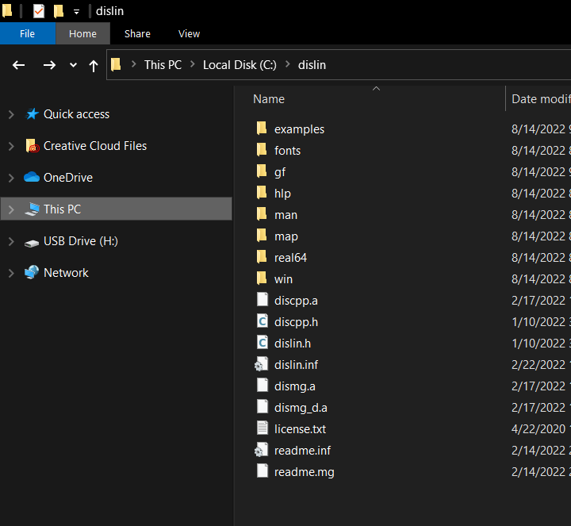

## **Configuration of the system**

12. Go to **control panel** and click **System**. 

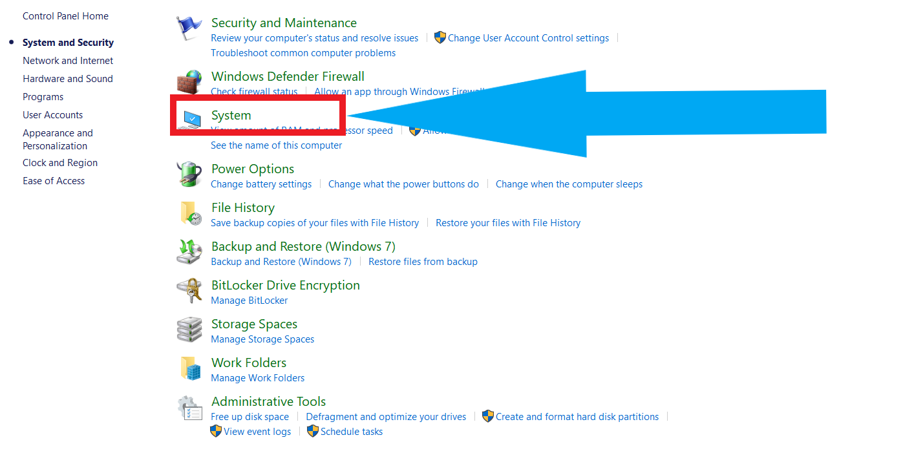

13. Select **Advanced system settings**. 

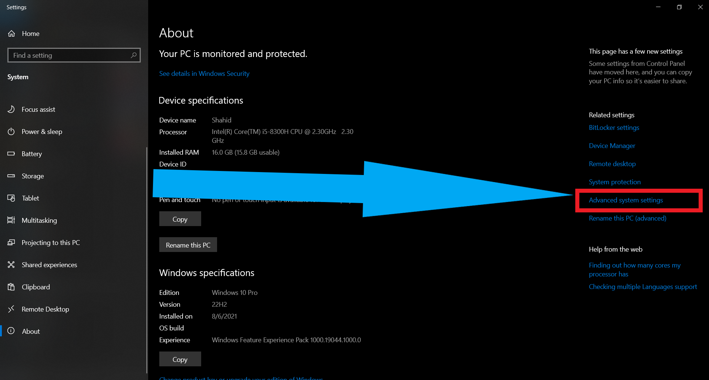

14. Check **Environment Variables**. 

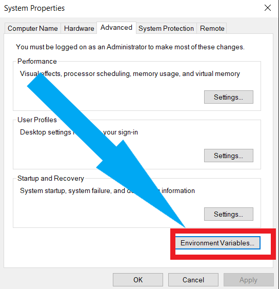

15. Click **New** and Enter **variable name** and **variable value** under **System Variable**. 

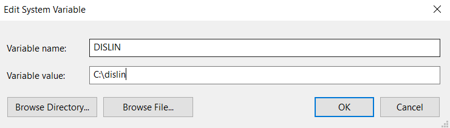

16. Under **path** make **New path** as **C:\dislin\win**. 

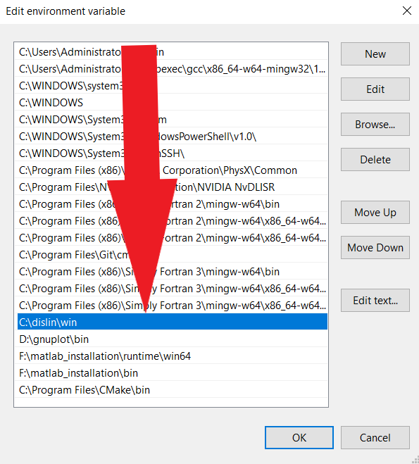

## **Dislin test**

Go to the folder **C:\dislin\gf** and see the files **dislin.mod** and **dislin.o**. If the compiled files are not present, compile the **dislin.f90** file with the command

    gfortran -c dislin.f90

Go to the folder **c:\dislin\examples** and enter **f90link -a exa_f90**

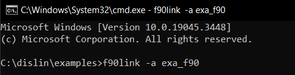

17. It shows the options for output

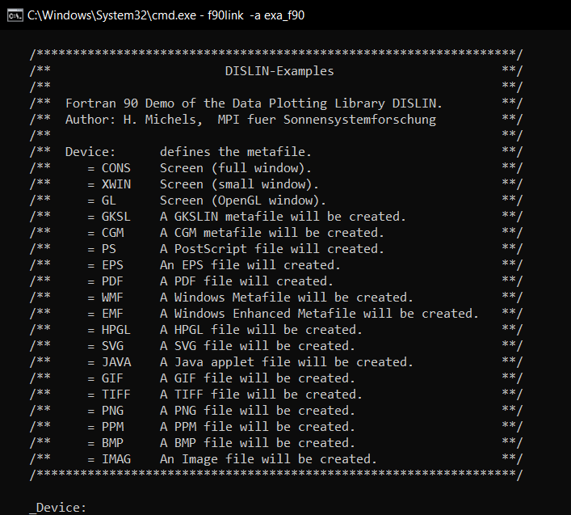

18. Enter **cons**. It shows following options. Enter **1**

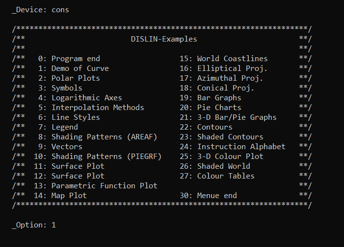

19. The output shows the **curve** on console.

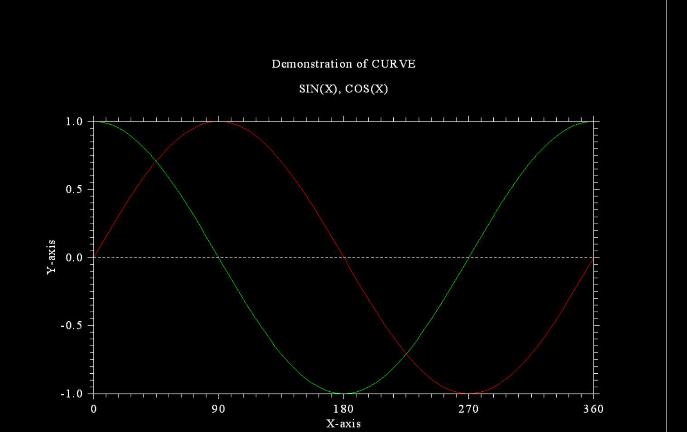

20. The output also shows the **dislin information** on console. Try other examples.

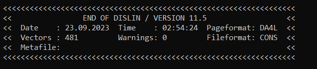

## **Double precision module**

By default dislin is single precision. To use double  precsion go to the folder **C:\dislin\gf\real64** and compile the file **dislin.f90** with command

    gfortran -c dislin.f90

---

**Date : 24 September 2023**
