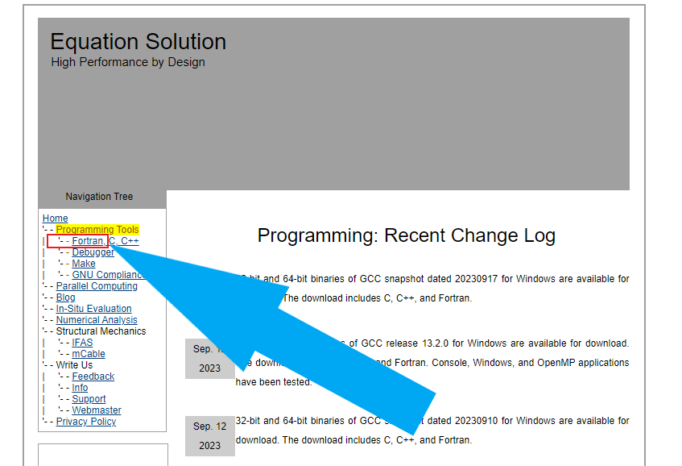
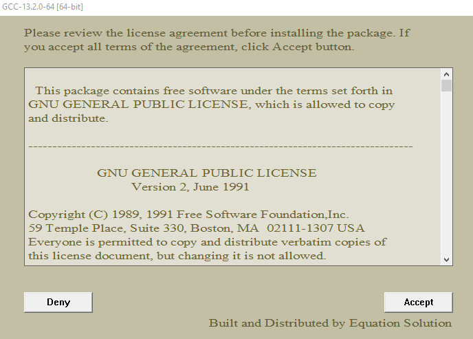
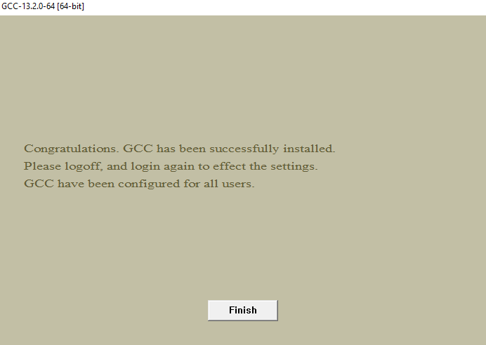

# **Installing GCC new version 13.2 (Windows 10)**

The steps below demonstrate how to update to the latest gfortran release. 

1. Navigate to the link:

http://www.equation.com/servlet/equation.cmd?fa=home

2. Select **Programming Tools** under **Home**.

3. Select **Fortran**

4. Select the version **gcc-13.2.0** under **Releases** and **64 bit** (assuming we are having 64 bit windows).

5. **Download** starts

6. Double click the file in **Download folder**

7. The next step looks like this after choosing the desired folder for installation. **Accept** it !

8. Click **Finish** when installation is complete.

9. Open **Command Prompt** from **Windows start menu** and enter 

10. **Great Job!** 

---

**Date: 24 September 2023**