# **Installing gnuplot version 5.4 (Windows 10)**

The steps below demonstrate how to download the latest gnuplot release. 

1. Navigate to the link:

http://www.gnuplot.info/

2. Select **Release 5.4.9** under **Version 5.4 ( current stable )**.

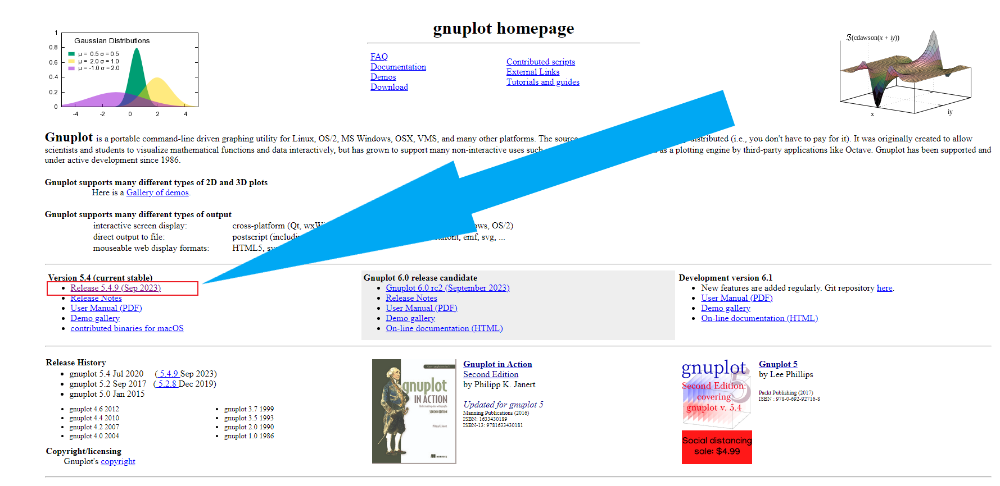

3. Select **Download Latest Version**

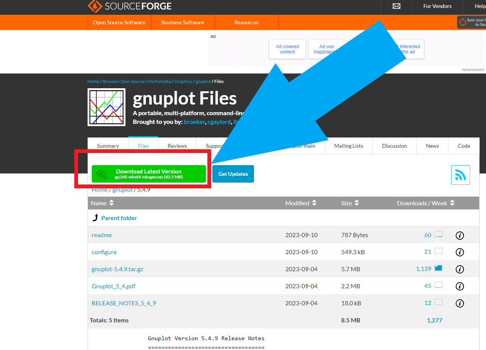

4. **Download** starts

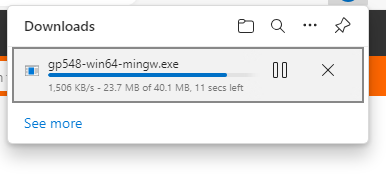

5. Double click the file in **Download folder**

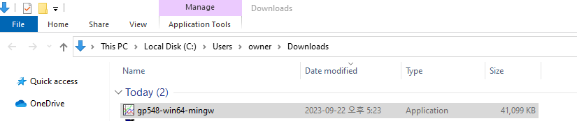

6. Select the **language**.

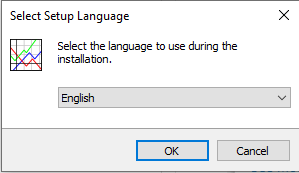

7. Accept the **licence agreement**.

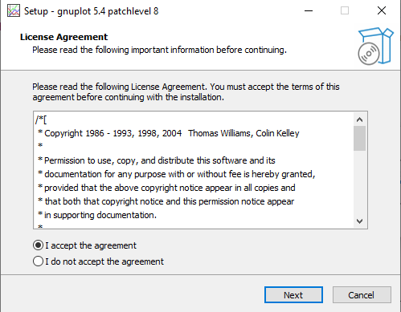

8. Select **destination location**. 

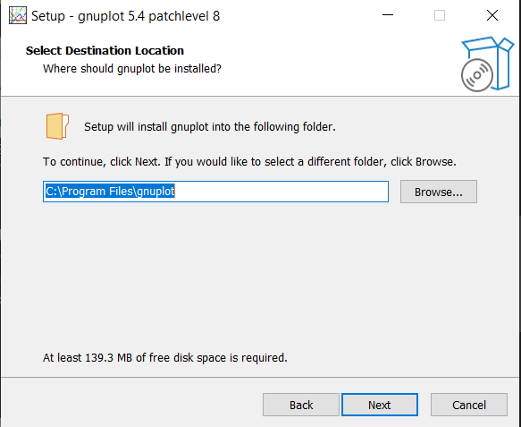

9. Select **Components**. 

10. Select **Start menu**. 

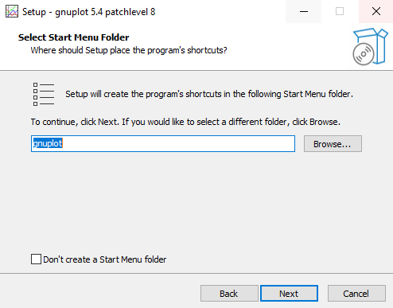

11. Select **Start menu**. 

12. Select **Additional Tasks**. 

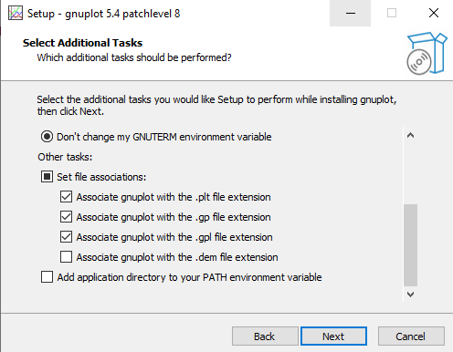

13. Click **install**

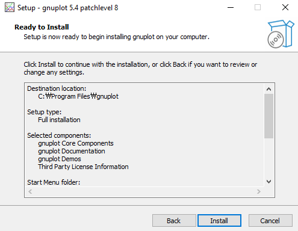

14. Click **Next**

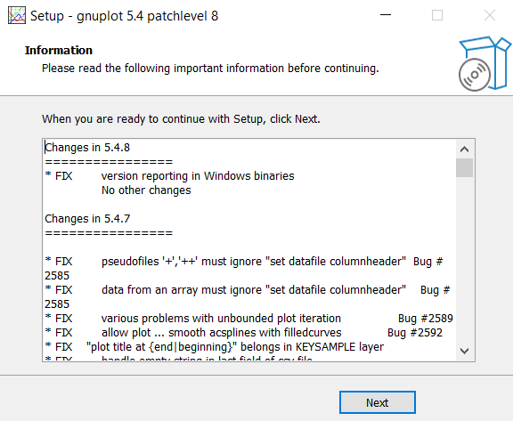

15. Click **Finish**

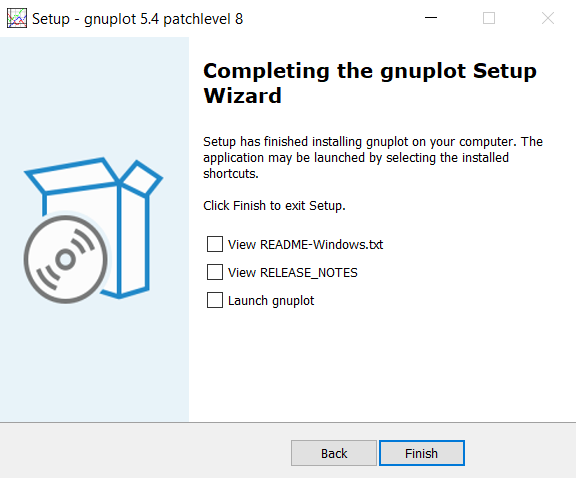

16. Go to **Windows start menu** and find two versions of gnuplot.

17. Click **gnuplot console version**. It shows:

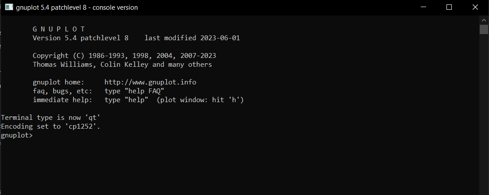

18. Click the other version. Notice the difference of two top rows with functionalities:

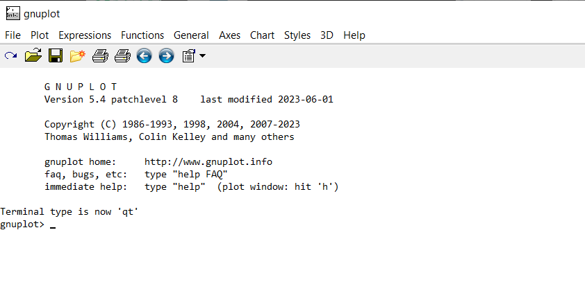

----
**Date: 24 September 2023**
